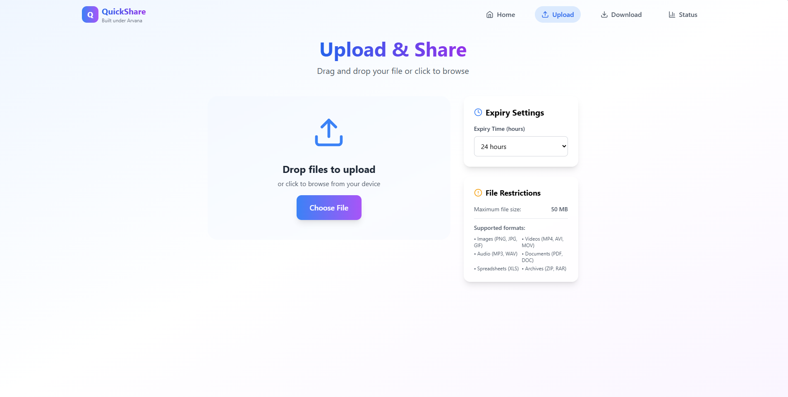
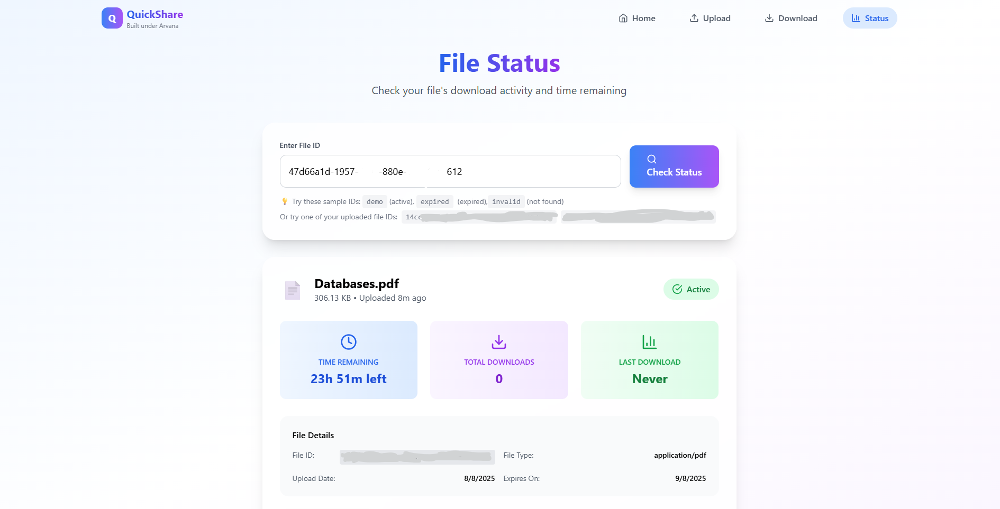

#  QuickShare – File Sharing with Expiry URLs  
###  Built under **Arvana**

QuickShare is a lightweight file-sharing service that lets users upload files and generate unique download links that **automatically expire** after a set duration (TTL – Time To Live). It’s perfect for **temporary file sharing**, **secure transfers**, and **time-bound downloads**.

>  No sign-ups. Simple API. Secure. Fast. Self-destructing links.

-------------------------------------------------------------------------

##  Demo Screenshots
  
  
  
  
  
  

-------------------------------------------------------------------------

##  Features

-  Upload files easily via frontend
-  Get a shareable unique link
-  Files auto-expire after TTL
-  Real-time status check (time remaining)
-  Secure one-time downloads
-  RESTful backend with Node.js + Express
-  Supabase storage integration
-  Full CORS and error handling

-------------------------------------------------------------------------

## Tech Stack

| Layer        | Tech                      |
|--------------|---------------------------|
| **Backend**  | Node.js, Express          |
| **Database** | Supabase (PostgreSQL)     |
| **Storage**  | Supabase Storage          |
| **Frontend** | React + TypeScript        |
| **Hosting**  | Render / Railway / Vercel |

-------------------------------------------------------------------------

##  How It Works

1. Users upload a file through the React frontend.
2. The backend stores the file and generates a **unique download link** with a **TTL** (time limit).
3. Users can share this URL with anyone.
4. The file will be downloadable **until it expires**.
5. A status endpoint helps track **remaining time** and **file availability**.

--------------------------------------------------------------------------

## Credits
Built Under 
Arvana
